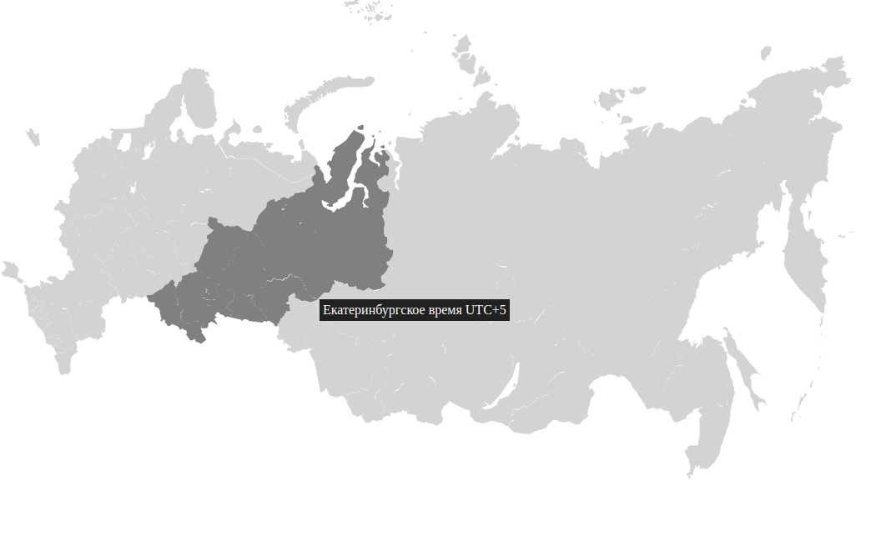

# RU-MAP

<a href="https://www.npmjs.com/package/ru-map">
    
</a>
<a href="https://github.com/iamkun/dayjs/blob/master/LICENSE">
    
</a>

### [English](./README.md) | [Русский](./docs/README_RU.md)

RU-MAP is a lightweight library for web applications, without third-party dependencies.<br/>
Contains an svg map of Russia, with the following capabilities:
1) Region selecting
2) Selecting of the federal district
3) Selecting a time zone (with information about the difference from UTC+0 in minutes)



## Table of contents
- [Getting started](#Getting-started)
    - [Native](#Native)
    - [React](#React)
    - [Interface Region](#Interface-Region)
- [Development](#Development)
- [Contributing](#Contributing)

## Getting started

### Native
Install npm package using command:
```sh
npm i ru-map
```

And add to your project:
```typescript
import { RUMap, type Region } from 'ru-map';

const idRootHTMLElement = 'ru-map-root';

const map = new RUMap(idRootHTMLElement, { 
    mode: 'region',
    locale: 'en',
    onRegionClick: (value: Region) => {
        // your code here
    }, 
});
```

### React
Install npm package using command:
```sh
npm i ru-map
```

```tsx
import { RUMap, Mode } from 'ru-map';
import { useEffect, useRef } from 'react';

export const Exaple = () => {
    const mapRef = useRef<RUMap | null>();

    // If you need outside control
    const changeMode = (mode: Mode) => {
        mapRef.current?.setMode(mode);
    };

    useEffect(() => {
        mapRef.current = new RUMap('ru-map-id', {
            mode: 'region',
            locale: 'en',
            onRegionClick: (value: Region) => {
                // your code here
            }, 
        });
    }, []);

    return (
        <>
            <div id="ru-map-id" />
        </>
    );
};
```

### Interface Region
The region interface contains:
```typescript
export interface Region {
    id: string; // id региона
    title: string; // Имя региона  'en' || 'ru'
    federalDistrict: string; // Округ региона 'en' || 'ru'
    timezone: string; // Часовой пояс региона 'en' || 'ru'
    timezoneOffset: number; // Смещение от UTC+0 в минутах
}
```

## Development

### Requirements
To install and run the project, you need:<br/>
[NodeJS](https://nodejs.org/) v20+.<br/>
[NPM](https://www.npmjs.com/) v10+.

### Installing dependencies
To install dependencies, run the command:
```sh
$ npm i
```

### Launching the Development server
To start the development server, run the command:
```sh
npm run dev
```

### Creating a build
To run a production build, run the command:
```sh
npm run build
```

## Contributing
Thank you for taking the time to read our rules for contributing to ru-map. You can start contributing in many ways, such as filing bug reports, improving code and documentation, or helping others.

Our open source community strives to be pleasant, welcoming, and professional. Abusive, harassing or otherwise inappropriate behavior will not be tolerated.

### Bugs
* Before submitting a bug report, look for similar tickets. Your problem may have already been discussed and resolved.
* Feel free to add comments to an existing issue, even if it is closed.
* Be careful when choosing a title and report, do not miss important details.
* In English, please.

### Pull Request
* ru-map is written in ES6.
* We use ESLint to test our code. You can use `npm run lint:fix` before submitting a pull request.
* Please use a semantic commit message.
* Commit and PR Standards<br/>
    We follow [Conventional Commits](https://www.conventionalcommits.org/en/v1.0.0/) for consistency. <br/>
    The available commit types are:

    **feat:** New features (triggers a minor release).<br/>
    **fix:** Bug fixes (triggers a patch release).<br/>
    **refactor:** Code structure changes without affecting functionality.<br/>
    **perf:** Performance improvements.<br/>
    **build:** Changes to the build system or dependencies.<br/>
    **chore:** Miscellaneous tasks that don’t modify source code or tests.<br/>
    **ci:** Updates to CI configuration.<br/>
    **docs:** Documentation updates.<br/>
    **test:** Adding or updating tests.<br/>
