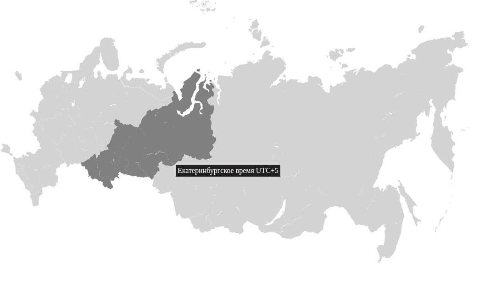

# RU-MAP

<a href="https://www.npmjs.com/package/ru-map">
    
</a>
<a href="https://github.com/iamkun/dayjs/blob/master/LICENSE">
    
</a>

### [English](../README.md) | [Русский](./README_RU.md)

RU-MAP - это лекговесная библиотека для web-приложений, без сторонних зависимостей.<br/>
Cодержит в себе svg карту России, с возможностями:
1) Выбора региона
2) Выбора федерального округа
3) Выбора часового пояса (с инфорамцией о разнице с UTC+0 в минутах)



## Начало работы
Установите npm-пакет с помощью команды:
```sh
$ npm i ru-map
```

И добавьте в свой проект:
```typescript
import { RUMap, type Region } from 'ru-map';

const idRootHTMLElement = 'ru-map-root';

const map = new RUMap(idRootHTMLElement, { 
    mode: 'region',
    locale: 'en',
    onRegionClick: (value: Region) => {
        // your code here
    }, 
});
```
Интерфейс региона содержит:
```typescript
export interface Region {
    id: string; // id региона
    title: string; // Имя региона  'en' || 'ru'
    federalDistrict: string; // Округ региона 'en' || 'ru'
    timezone: string; // Часовой пояс региона 'en' || 'ru'
    timezoneOffset: number; // Смещение от UTC+0 в минутах
}
```

## Разработка

### Требования
Для установки и запуска проекта, необходимы:<br/>
[NodeJS](https://nodejs.org/) v20+.<br/>
[NPM](https://www.npmjs.com/) v10+.

### Установка зависимостей
Для установки зависимостей, выполните команду:
```sh
$ npm i
```

### Запуск Development сервера
Чтобы запустить сервер для разработки, выполните команду:
```sh
npm run dev
```

### Создание билда
Чтобы выполнить production сборку, выполните команду: 
```sh
npm run build
```

## Вклад в развитие
Спасибо, что уделили время прочтению наших правил по внесению вклада в ru-map. Вы можете начать вносить вклад многими способами, например, подавая отчеты об ошибках, улучшая код и документацию или помогая другим.

Наше сообщество открытого исходного кода стремится быть приятным, гостеприимным и профессиональным. Случаи оскорбительного, домогательного или иного неприемлемого поведения не будут допускаться.

### Запрос на извлечение
* ru-map написан на ES6.
* Мы используем ESLint для проверки нашего кода. Вы можете использовать `npm run lint:fix` перед отправкой запроса на извлечение.
* Пожалуйста, используйте семантическое сообщение о коммите.

### Ошибки и предложения
* Перед отправкой отчета об ошибке, поищите похожие тикеты. Ваша проблема могла уже обсуждаться и решаться.
* Не стесняйтесь добавлять комментарии к существующей проблеме, даже если она закрыта.
* Будьте внимательны при выборе заголовка и отчета, не упускайте важные детали.
* По-английски, пожалуйста.